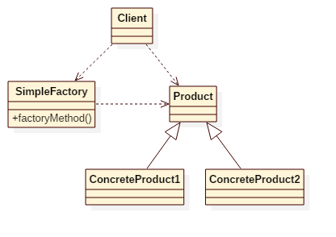

# Simple Factory Pattern
## Intent
Creates objects without exposing the instantiation logic to the client.

## Applicability
Use the Simple Factory pattern when

* you want to provide a class library of products, and you want to reveal just their interfaces, not their implementations.
* a system should be independent of how its products are created, composed, and represented.

## Structure

